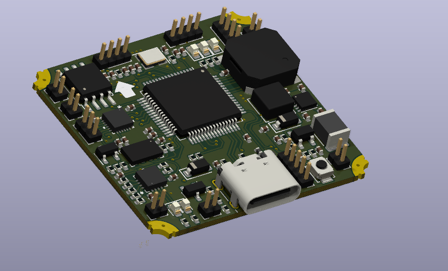
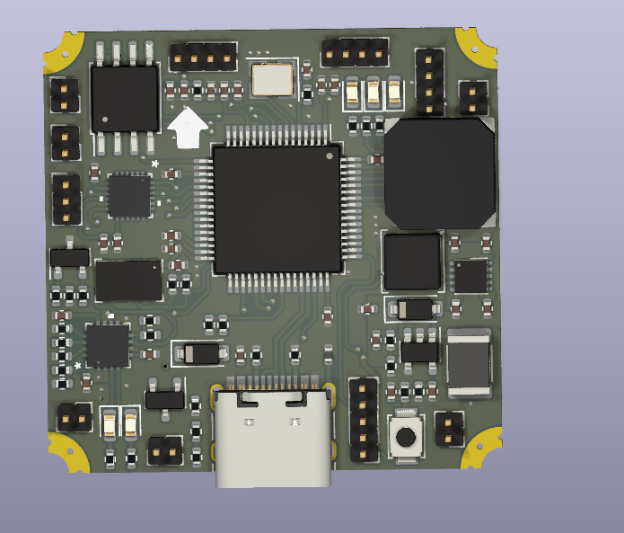
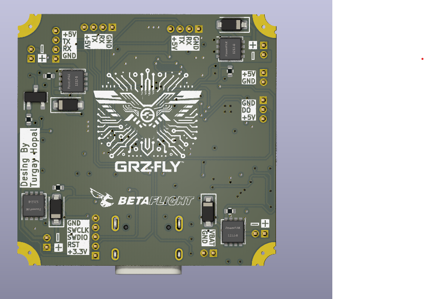

# Micro Flight Controller

- This project developed for micro drone.

### Board Features

- STM32F422RET6 Microcontroller
- 1A Buck-Boost Converter (TPS63031)
- CRSF Port (like RadioMaster RP1)
- 128 KB External Flash
- MS5611 Barometer
- MPU6500 Sensor

### PCB Features

- 35.1mm x 34.1mm
- 1mm board thickness.
- 4 layer PCB.
- 0.45 / 0.3 vias

### Right Side

### Front Side

### Back Side

